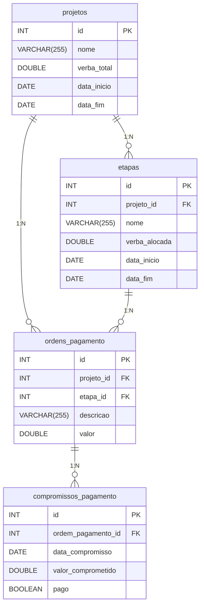

# GPT Backend

## Descrição

Este projeto é um backend para sincronização de estrutura de banco de dados utilizando OpenAI. O sistema permite a sincronização automática do esquema de banco de dados MariaDB com base em diagramas ER (Entidade-Relacionamento). Além disso, oferece uma API de conversação que permite interagir com o banco de dados através de linguagem natural.

## Pré-requisitos

- Node.js v14 ou superior
- MariaDB/MySQL
- NPM ou Yarn
- Conta na OpenAI com chave de API válida

## Instalação

1. Clone o repositório:
   ```bash
   git clone https://github.com/lucasreno/gpt-be.git
   cd gpt-be
   ```

2. Instale as dependências:
   ```bash
   npm install
   ```

3. Configure as variáveis de ambiente copiando o arquivo `.env` de exemplo e ajustando conforme necessário:
   ```bash
   cp .env.example .env
   ```

## Configuração

Edite o arquivo `.env` com suas configurações:

```properties
PORT=3000
DB_HOST=localhost
DB_USER=root
DB_PASSWORD=sua-senha
DB_DATABASE=gpt
OPENAI_API_KEY=sua-chave-api-openai
```

> ⚠️ **Importante**: É necessário configurar a chave de API da OpenAI (`OPENAI_API_KEY`) nas variáveis de ambiente para que o sistema funcione corretamente. Obtenha sua chave em https://platform.openai.com/api-keys.

## Como executar

Para iniciar o servidor em modo desenvolvimento:

```bash
npm start
```

## Estrutura do Projeto

```
/c:/oneway/gpt-be/
│
├── config/                        # Configurações do projeto
├── controllers/                   # Controladores da API
│   └── conversationController.js  # Controlador da API de conversação
├── db/                            # Camada de acesso ao banco de dados
│   └── database.js                # Funções de conexão e consulta ao banco
├── docs/                          # Documentação
│   └── postman/                   # Coleções do Postman para teste da API
├── services/                      # Serviços da aplicação
│   ├── conversationService.js     # Serviço de processamento de conversação
│   ├── dbSyncService.js           # Serviço de sincronização de estrutura do banco
│   └── openaiService.js           # Serviço de integração com a OpenAI
├── utils/                         # Utilitários
│   ├── fileHelpers.js             # Auxiliares para manipulação de arquivos
│   └── logger.js                  # Sistema de log
├── routes/                        # Rotas da API
│   ├── conversationRoutes.js      # Rotas para API de conversação
│   └── index.js                   # Definição das rotas
├── erDiagram                      # Arquivo de diagrama ER para sincronização
├── server.js                      # Ponto de entrada da aplicação
├── .env                           # Variáveis de ambiente (não versionado)
├── .gitignore                     # Arquivos ignorados pelo Git
└── README.md                      # Documentação do projeto
```

## Funcionalidades

- Sincronização automática da estrutura do banco de dados baseada em diagramas ER
- Integração com a API OpenAI para interpretação inteligente dos diagramas
- Sistema de logs para monitoramento das operações
- API RESTful para interação com o sistema
- API de conversação para consultas ao banco de dados em linguagem natural
  - Início de novas conversações
  - Processamento de mensagens com tradução para SQL quando necessário
  - Formatação dos resultados em formato amigável

## API de Conversação

A API de conversação permite interagir com o banco de dados usando linguagem natural. O sistema interpreta as consultas, traduz para SQL quando necessário, executa as consultas e retorna os resultados em formato amigável.

### Endpoints

- **POST /conversation/start**: Inicia uma nova conversa
- **POST /conversation/message**: Envia uma mensagem para a conversa

## Testando com Postman

Incluímos uma coleção do Postman para facilitar os testes da API de conversação. Para utilizá-la:

1. Abra o Postman
2. Clique no botão "Import" (Importar) no canto superior esquerdo
3. Escolha o arquivo `gpt-be/docs/postman/conversation_api_collection.json`
4. A coleção "GPT Conversation API" será importada com todos os exemplos de requisições

### Exemplo de Uso

1. Inicie com a requisição "Start Conversation" para inicializar uma conversa
2. Use a resposta dessa chamada nas requisições subsequentes "Send Message" atualizando o campo `conversation` no corpo da requisição
3. Teste com perguntas como:
   - "Mostre todos os projetos ativos"
   - "Qual é o status dos pagamentos do cliente ABC Ltda?"
   - "Quem é o cliente do projeto de Redesenho Site Corporativo?"

## Exemplo de Diagrama ER

O sistema aceita diagramas ER no formato Mermaid. Abaixo está um exemplo de um diagrama que pode ser processado pelo sistema:



## Licença

Este projeto está licenciado sob a [Licença MIT](LICENSE).
